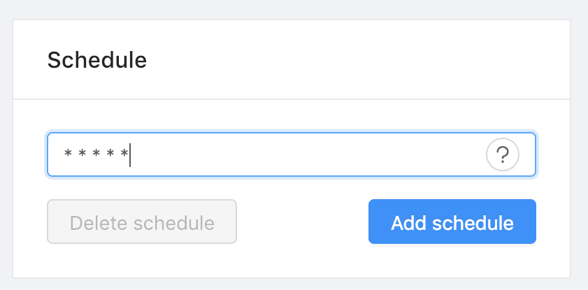

# Schedule

Once a Schedule is added, the corresponding Recipe and Configuration will become read-only (except for the Recipe name), in order to prevent any unintentional changes that may affect the scheduled future Jobs. 

Note that incremental load is not automatically turned on for scheduled transformations, which means the full data set will be transformed in each iteration.

## Cron Format
Jetfire Schedules should be written in Cron format consisting of five fields: 

`<Minute> <Hour> <Day_of_the_Month> <Month_of_the_Year> <Day_of_the_Week>`

[Learn more](https://en.wikipedia.org/wiki/Cron)

