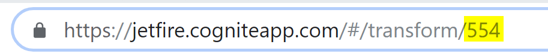

# FAQ

## What functions do I've access to in my SQL?
See [Jetfire SQL Functions](../concepts/jetfire-sql-functions.md)

## I know there is data in my table, why can't I see it in Jetfire?
In order to see data in Jetfire, you need to use an api-key with the right to see that data. For raw that would be RAW_READ access. You can check here, whether you have that or not.

## How to access data from CLEAN?
* Assets: _cdp.asset
* Events: _cdp.event
* Datapoints: _cdp.datapoints where name = 'some_timeseries'
* Timeseries metadata: _cdp.timeseries
#### Example
```sql
select * from _cdp.asset
```

## How to copy an asset hierarchy from one tenant to another?
* Go to https://transformers.cogniteapp.com with your source tenants api key.
* Create a transform:
```sql
select string(id) as key, string(id) as UID, string(parentId) as parentUID, name, description as description, to_json(metadata) as metadata from _cdp.asset
```
* Choose "asset preparation" from the drop down and click the "transform"-button
* Enter the api key of your target tenant, enter some existing db name, enter some table name
* Click "transform" and watch the job at Jobs tab
* When it says it finished, login to https://transformers.cogniteapp.com with your target tenant's api key
* Check if the data is there
* Go to https://admin.cogniteapp.com/pipelines, log in with your target tenants credentials and create an asset purgatory pipeline on the target table of that last job

## How to schedule a transformation
**There is no incremental load, so this will do full data set for each iteration! Be considerate!**

#### Step-by-Step instructions
* Create the transform you want to schedule and run it once with the correct destination etc. (These settings will be stored and used when scheduled)
* Write down the ID of your transform 
* Send a POST request in this format, where interval is the schedule in cron format with 5 vars.
```sh
curl -X POST \
https://jetfire.cogniteapp.com/api/schedule/config/{{ID of your transformation}}\
-H 'Content-Type: application/json' \
-H 'api-key: {{api-key}}' \
-H 'cache-control: no-cache' \
-d '{ "interval": "* * * * *" }'
```
Real world example:
```sh
curl -X POST \
  https://jetfire.cogniteapp.com/api/schedule/config/92 \
  -H 'Content-Type: application/json' \
  -H 'api-key: WfHzzHnmIKIZgnMkujhggbNPJkmjkHjmkHbHhj' \
  -H 'cache-control: no-cache' \
  -d '{ "interval": "0 0 * * *" }'
```

Available calls:

* GET -> https://jetfire.cogniteapp.com/api/schedule/config/{{ID of your transformation}}
Get information about a scheduled config


* POST -> https://jetfire.cogniteapp.com/api/schedule/config/{{ID of your transformation}}
Create a new schedule for the config (only one schedule is supported per config). The body should be
{ "interval": "* * * * *" // Cron formatted interval }


* DELETE -> https://jetfire.cogniteapp.com/api/schedule/config/{{ID of your transformation}}
Delete a schedule


## How can I put weird db-, column-, or field names?
Use backticks: 
```sql
`[columnName]`
```
```sql
select * from `strange.db.name.with.dots`.`this(table)has(brackets)`
```
