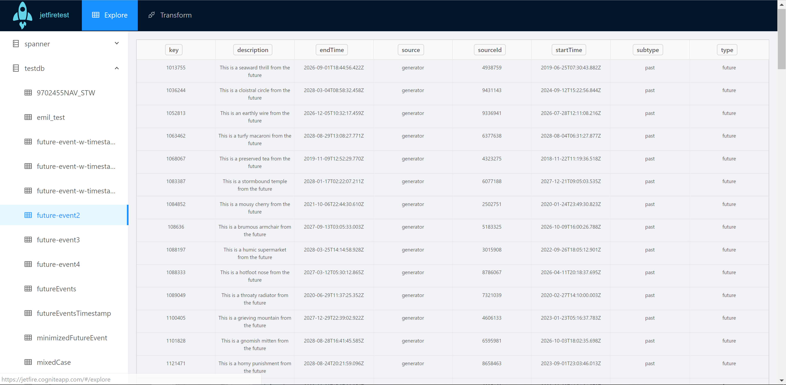
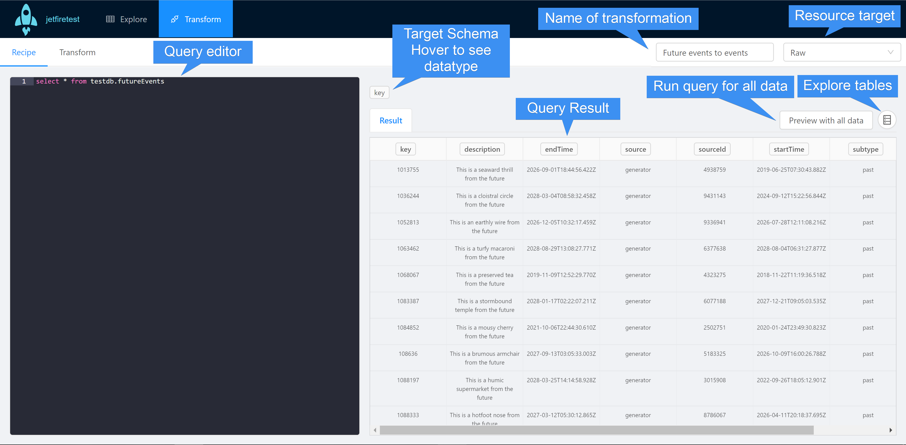

# Getting Started with Jetfire
Jetfire is a tool for developing transformations from and to CDP resources. Spark SQL is used as the language to describe the transformation. The tool is located at https://jetfire.cogniteapp.com, and you login by providing a CDP api-key of a project of choice.

## Explore
After logging in, you'll see the explore editor. Here you can explore [Raw](../concepts/raw.md) tables. You can look at the content of a table by clicking on any table. You can also sort columns lexically by clicking at the column header. 

## Transform
Clicking the transform menu item brings you to a list of transformations. Since this is your first time, the list is empty. Click the new transform button to create a new transformation.

## Recipe editor
After creating a transformation, you'll see the recipe editor. Every change you do in this view is auto-saved.

Your goal is to make a query that matches the target schema, so that you can transform to that target. When that's done, head over at the 'Transform' section to configure the recipe, as choosing destination. The transform button is only enabled if the recipe and the configuration are valid. Clicking it will trigger a job executing the given tranformation. You will also see metrics tied to the job in the same view. **Note** it can take a while before the metrics are shown.

## Further reading
* [Basic concepts](../concepts/basics.md)
* [Jetfire SQL Functions](../concepts/jetfire-sql-functions.md)